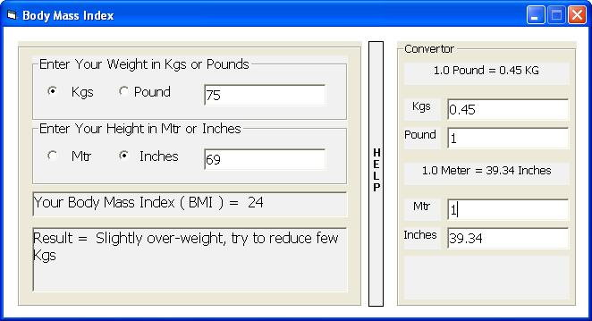



## Body Mass Index

### Description

Check out this for Body Mass Index with Weight and Height converter (Kilograms to Pound to Kilograms and Meter to Inches to Meter)

if found ant bugs pls replay me on haresh_valni@yahoo.com

Pls, vote me.
 
### More Info
 

             |
---                |---
**Submitted On**   |2008-08-09 18:45:52
**By**             |[Divyasavi](https://github.com/Planet-Source-Code/PSCIndex/blob/master/ByAuthor/divyasavi.md)
**Level**          |Beginner
**User Rating**    |4.3 (13 globes from 3 users)
**Compatibility**  |VB 6\.0
**Category**       |[Complete Applications](https://github.com/Planet-Source-Code/PSCIndex/blob/master/ByCategory/complete-applications__1-27.md)
**World**          |[Visual Basic](https://github.com/Planet-Source-Code/PSCIndex/blob/master/ByWorld/visual-basic.md)
**Archive File**   |[Body\_Mass\_2123158102008\.zip](https://github.com/Planet-Source-Code/divyasavi-body-mass-index__1-70940/archive/master.zip)

